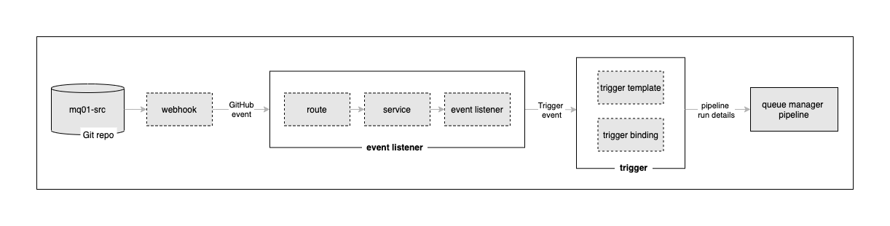
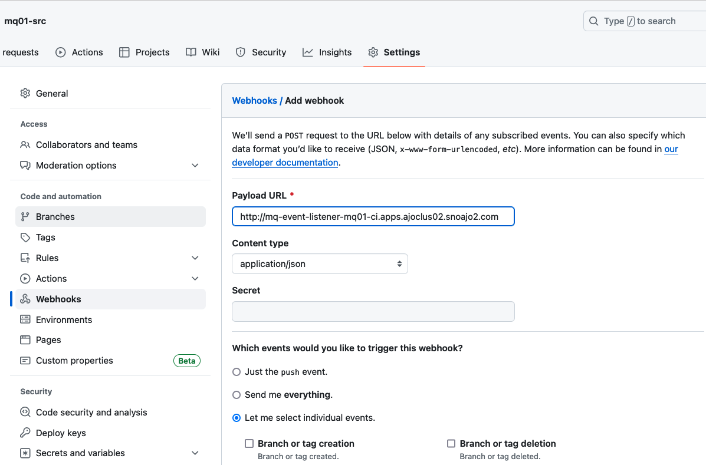
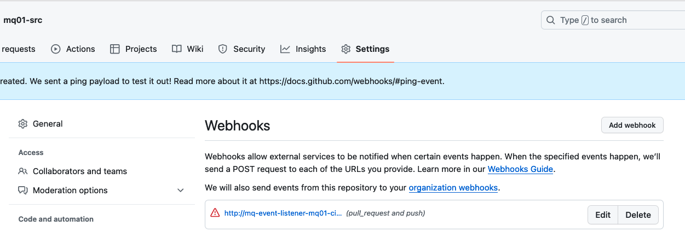
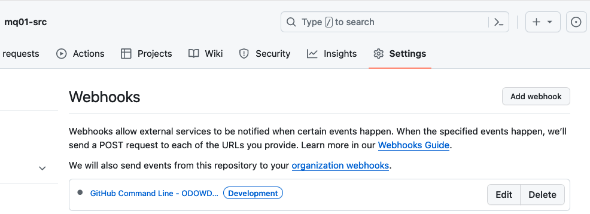

# Adding continuous integration

In this tutorial extension, we're going to enhance the continuous integration
process to build, test and version `mq01`. Specifically, we're going to ensure
that any change to the `mq01-src` repository will **automatically** result in a
an updated `mq01` queue manager being built and deployed to the cluster -- we
will no longer need to run the pipeline manually. The resultant queue manager
will still reference the same queue files and log files -- no messages will be
lost.

---

## Tekton event listeners and triggers

The following diagram shows the components that ensure that every time the
`mq01-src` repository changes, the pipeline to build `mq01` will be run. In this
part of the tutorial, we're going to set up the GitHub webhook, the event
listener and trigger components.



In the diagram we can see how a code change is committed to `mq01-src`, results
in a GitHub event containing information about the change is generated by the
webhook. This event is processes by an **event listener**, which comprises a
normal `route` and `service` front-ending a Tekton `eventlistener` custom
resource. Its the Tekton event listener that runs the pipeline using a Tekton
**trigger**.  A trigger has two components: a `triggerbinding` that takes data
 from the GitHub event and passes it to a `triggertemplate` that specifies the
 pipeline to run.

 Let's set up these components now.

---

## Customizing the event listener

A webhook provides a loosely coupled connection between a GitHub change and the
processor of that change. The design is slightly more involved than directly
linking GitHub to a pipeline, but as we'll see, it is much more flexible. This
[short
article](https://cloud.redhat.com/blog/guide-to-openshift-pipelines-part-6-triggering-pipeline-execution-from-github)
provides a nice overview on how to use webhooks with Kubernetes.

Issue the following command to view the template of the event listener YAML:

```bash
cd extra/tutorial2
cat mq-event-listener.yaml
```

``` yaml
apiVersion: triggers.tekton.dev/v1alpha1
kind: EventListener
metadata:
  labels:
    app: mq-event-listener
  name: mq-event-listener
  namespace: mq01-ci
spec:
  serviceAccountName: pipeline
  triggers:
  - name: mq-trigger
    interceptors:
      - ref:
          name: "cel"
        params:
        - name: "filter"
          value: "header.match('X-GitHub-Event', 'push') && body.ref == 'refs/heads/main' && body.repository.full_name == '$GITORG/mq01-src'"
    bindings:
      - ref: mq-trigger-binding
    template:
      ref: mq-trigger-template
```

Note:
* the event listener will intercept GitHub events (`X-GitHub-Event`.
* the event listener will intercept `push` operations to the `$GITORG/mq01-src`
  repository.
* the event listener will pass the webhook information to `mq-trigger-binding`
  and `mq-trigger-template` to run the pipeline.

You can read more about [event listeners, triggers and
interceptors](https://tekton.dev/docs/triggers/).

We'll see the details of how these components work later; for now, let's tailor
the event listener YAML for our organization.

Issue the following command:

```bash
envsubst < mq-event-listener.yaml > eventfile.tmp && mv eventfile.tmp mq-event-listener.yaml
```

Then re-issue the following command to verify that `$GITORG/mq01-src` value
has been replaced with your organization name:

```bash
cat mq-event-listener.yaml
```

Examine the `params.filter` value to confirm the substitution, for example:
```yaml
mqorg-odowdaibm/mq01-src
```

---

## Deploying the event listener

Let's now deploy the customized event listener to the cluster using the relevant
YAMLs to create the event listener, its route and service.

Issue the following commands:

```bash
oc apply -f mq-event-route.yaml
oc apply -f mq-event-listener.yaml
```

which will return the following output:

```bash
route.route.openshift.io/mq-event-listener created
eventlistener.triggers.tekton.dev/mq-event-listener created
```

The event listener `route`, `service` and `eventlistener` Kubernetes resources
are now active in the cluster; let's explore them.

---

## Verify the event listener deployment

Issue the following commands to verify the route, service and event listener
have been created:

```bash
oc get route mq-event-listener -n mq01-ci -o yaml
```
```bash
oc get eventlistener -n mq01-ci -o yaml
```
```bash
oc get service el-mq-event-listener -n mq01-ci -o yaml
```

Specifically, note that the event listener service `el-mq-event-listener` is created
automatically by the event listener, and referred to by the route. Now that
we've got the **event listener** in our diagram fully deployed, let's
configure and install the trigger that it will use to run the pipeline.

Feel free to explore the YAML output to see how these components are linked.

---

## Creating the trigger binding

The trigger comprises a **trigger binding** that gets the necessary data
from the webhook event, and a **trigger template** that uses this data to call
the pipeline.

Let's examine, customize and deploy the trigger binding gather the necessary
data from the webhook for the pipeline.

Issue the following command to examine the trigger binding:

```bash
cat mq-trigger-binding.yaml
```

```yaml
apiVersion: triggers.tekton.dev/v1alpha1
kind: TriggerBinding
metadata:
  labels:
    app: mq-trigger-binding
  name: mq-trigger-binding
  namespace: mq01-ci
spec:
  params:
  - name: gitrevision
    value: $(body.head_commit.id)
  - name: gitrepositoryurl
    value: $(body.repository.url
```

Notice how the trigger binding uses `gitrevision` and `gitrepositoryurl` to
store the corresponding values extracted from the event generated by the event
listener. These values will be passed to trigger template.

Issue the following command:

```bash
oc apply -f mq-trigger-binding.yaml
```

which will confirm that the trigger binding has been created.

```bash
triggerbinding.triggers.tekton.dev/mq-trigger-binding created
```

---

## Customizing the trigger template

Whereas the **trigger binding** gets the necessary data from the webhook event,
its the **trigger template** marshals this, and other data, to run the
pipeline.

Let's examine, customize and deploy the trigger template that will run the
pipeline.

Issue the following command:

```bash
cat mq-trigger-template.yaml
```

that will show the details of the trigger template:

```yaml
apiVersion: triggers.tekton.dev/v1alpha1
kind: TriggerTemplate
metadata:
  labels:
    app: mq-trigger-template
  name: mq-trigger-template
  namespace: mq01-ci
spec:
  params:
  - description: The git revision
    name: gitrevision
  - description: The git repository url
    name: gitrepositoryurl
  resourcetemplates:
  - apiVersion: tekton.dev/v1beta1
    kind: PipelineRun
    metadata:
      generateName: mq-dev-pipeline-run-
    spec:
      workspaces:
      - name: shared-data
        volumeClaimTemplate:
          spec:
            accessModes:
            - ReadWriteOnce
            resources:
              requests:
                storage: 1Gi
      - name: git-creds
        secret:
          secretName: mq01-git-credentials
      params:
      - name: source-repo-url
        value: $(tt.params.gitrepositoryurl)
      - name: revision
        value: $(tt.params.gitrevision)
      - name: dockerfile
        value: $(workspaces.source.path)/repo/main/bin/Dockerfile
      - name: ops-repo-url
        value: https://github.com/$GITORG/mq01-ops.git
      - name: image-reference
        value: image-registry.openshift-image-registry.svc:5000/mq01-ci/mq01
      - name: storage-driver
        value: vfs
      - name: tls-verify
        value: "false"
      - name: git-user-name
        value: "odowdaibm"
      - name: git-user-email
        value: "a_o-dowd@uk.ibm.com"
      pipelineRef:
        name: mq-dev-pipeline
```

Notice how:
* `pipelineRef` identifies that this trigger template will create a pipelinerun
  for the `mq-dev-pipeline` pipeline. It will be invoked with the following params:
  * `source-repo-url` uses the `gitrepositoryurl` value from the trigger binding.
  * `revision` uses the `gitrevision` value from the trigger binding.
  * `ops-repo-url` identifies the repository that will store the YAMLs generated
    for `mq01``.
  * `image-reference` identifies the image that will be built by the pipeline; a
    version tag will be appended to this value, for example `mq01:0.0.1`.

Let's tailor the trigger template for our organization.

```bash
envsubst < mq-trigger-template.yaml > templatefile.tmp && mv templatefile.tmp mq-trigger-template.yaml
```

You can re-issue the following command to verify that `...$GITORG/mq01-ops.git` value
has been replaced with your organization name.

```bash
cat mq-trigger-template.yaml
```

Examine the `params.ops-repo-url` value to confirm the substitution.

---

## Create the trigger template

Let's now create the trigger template in the cluster using our customized YAML.

Issue the following command:

```bash
oc apply -f mq-trigger-template.yaml
```

which will confirm that the trigger template has been created:

```bash
triggertemplate.triggers.tekton.dev/mq-trigger-template created
```

---

## Verify trigger binding and template

We can verify the details of the trigger binding and trigger template.

Issue the follow commands:

```bash
oc get triggerbinding mq-trigger-binding -n mq01-ci -o yaml
```
```bash
oc get triggertemplate mq-trigger-template -n mq01-ci -o yaml
```

Feel free to explore the output.

---

## The GitHub webhook UI

Let's now use the GitHub UI to configure a webhook that creates an event, and
sends it to the route whenever the `mq01-src` repository changes.

Issue the following command to determine the URL for the GitHub UI:

```bash
echo https://github.com/${GITORG}/mq01-src/settings/hooks/new
```

for example:

``` { .text .no-copy }
https://github.com/mqorg-odowdaibm/mq01-src/settings/hooks/new
```

Copy the URL into your browser to launch the GitHub webpage to configure a new
webhook for your `mq01-src` repository:



Let's now configure this wqebhook.

---

## Configure the webbook

If your cluster is enabled for DNS, you can configure the webhook using the
following instructions.  However, if your cluster address is not DNS enabled,
use this [optional topic](#optional-configure-the-github-webhook-forwarder) to
configure the webhook forwarder.

Complete the webhook details as follows:
* Set the **Payload URL** using the event listener route address.
  Use the following command to determine this URL:
    ```bash
     echo http://$(oc get route mq-event-listener -n mq01-ci -o jsonpath='{.spec.host}')
     ```
* Set **Content type** to `application/json`.
* Select **Let me select individual event**
  * Select **Pull requests** from the list of available events.
  * Select and **Pushes**  from the list of available events.

Click on `Add webhook` to create the webhook.

In the GitHub UI, you can see that a new webhook has been added:



Notice the webhook's name and that it is generating an event whenever a
`pull-request` or `push` is issued against this repository.

Let's now make a change to the `mq01-src` source repository and watch the
webhook at work.

---

## (Optional) Configure the GitHub webhook forwarder

If your Kubernetes cluster is not DNS-enabled, then you cannot specify the
evenet listener route in webhook configuration. In this scenario, you can use
the GitHub webhook forwarding feature to make your local machine as a bridge to
your cluster. This is good for development and test scenarios, when you are
experimenting.

The forwarder runs on your local machine. It connects to GitHub to receive the
webhook when it is generated, which then it forwards to your cluster. You can
configure `/etc/hosts` on your local machine so that domain name resolution
works as expected.

Use the [GitHub webhook
instructions](https://docs.github.com/en/webhooks/testing-and-troubleshooting-webhooks/using-the-github-cli-to-forward-webhooks-for-testing)
to install the `gh` CLI and webook extension.

Let's start the GitHub webhook forwarder on your local machine. It will run
continuously, so you might want to start another terminal, ensuring that the
`$GITUSER` and `$GITORG` environment variables are set.

In a terminal window, issue the following command:

```bash
export CLUSTERURL=http://$(oc get route mq-event-listener -n mq01-ci -o jsonpath='{.spec.host}')
echo "Retrieving events from $GITORG/mq01-src and forwarding to $CLUSTERURL"
gh webhook forward --repo=$GITORG/mq01-src --events=pull_request,push --url=$CLUSTERURL
```

which will show that the webhook is forwarding events from the source repository to the target URL:

```bash
gh webhook forward --repo=$GITORG/mq01-src --events=pull_request,push --url=$CLUSTERURL
Retrieving events from mqorg-odowdaibm/mq01-src and forwarding to http://mq-event-listener-mq01-ci.apps.ajoclus02.snoajo2.com
Forwarding Webhook events from GitHub...
```

> **Note**<br>
>
> You will need to add the URL hostname to your local machine `/etc/hosts` file
> so that the GitHub forwarder can resolve the address, for example
>
> `141.125.162.227 mq-event-listener-mq01-ci.apps.ajoclus02.snoajo2.com`

You can also verify that the GitHub forwarder is connected to GitHub for these
events.

Copy the URL generated by the following command into your browser:

```bash
echo https://github.com/${GITORG}/mq01-src/settings/hooks
```

You will see that the GitHub forwarder is active:



Feel free to explore the webhook to verify that the GitHub forwarder will
receive the same events as a DNS configure webhook.

Now that we've configured our webhook, together with the Kubernetes resources to
process an event generated by it, let's put it to work.

---

## Making a change to the queue manager `mq01`

Let's now add a new queue to `mq01`. To do this, we'll update the `mq01-src`
repository -- and commit this change. This will trigger a new pipeline run that
will build and test our change. If successful, a new version of `mq01` container
image will be created and stored in the image registry ready for deployment to
the cluster.

---

 ## Update `mq01-qmgr.yaml`

Let's quickly review the current `mq01-qmgr.yaml` file, before we add our new
resource limit definitions.

Issue the following command:

```bash
cat kustomize/base/generic-qmgr/queuemanager.yaml
```

to view the resource limit definitions:

```{ .text .no-copy }
resources:
  limits:
    cpu: "1"
    memory: 1Gi
  requests:
    cpu: "1"
    memory: 1Gi
```

Using your favorite editor, update memory to `2Gi`:

```text hl_lines="4"
resources:
  limits:
    cpu: "1"
    memory: 2Gi
  requests:
    cpu: "1"
    memory: 1Gi
```

Notice how we've modified the `memory` of the queuemanager from `1Gi` to `2Gi`.

---

## Examine GitHub event

This push to GitHub should generate a GitHub webhook event for the `mq-qm01`
repository.  We can look at the most recent webhook events.

Click on the newly created webhook `http://el-cnkt-event-listener...` and
select the **Recent Deliveries** tab.

This is one of our sample Deliveries:


Notice:

* The date and time when the webhook event was generated in the format
  `yyyy-mm-dd hh:mm:ss`
* The **Request URL** header identifies the event.
  listener `http:://el-cnkt-event-listener...`
* **"ref": "refs/heads/qm1-GitOps-MQ-23052022"** identifies the branch that
  was pushed.
* **"repository.full_name": "GitOps-MQ-23052022/mq-qm01"** identifies the
  repository that was changed.

The **Recent Deliveries** tab can be very helpful to diagnose any issues you
might have webhook event generation.

Let's now see how this webhook event is handled by the event listener in the
cluster.

---

## View Tekton event handled in the cluster

Let's have a look at how the GitHub event is processed by the event listener
in the cluster. We can look at the event listener logs to see how the event is
received and processed using the `oc logs` command.

Issue the following command:

```bash
oc logs deploy/el-cnkt-event-listener -n ci
```

to show the log messages issued by the `el-cnkt-event-listener`:

``` { .json .no-copy }
{"level":"info","ts":"2022-05-30T08:53:23.172Z","logger":"eventlistener","caller":"resources/create.go:98","msg":"Generating resource: kind: &APIResource{Name:pipelineruns,Namespaced:true,Kind:PipelineRun,Verbs:[delete deletecollection get list patch create update watch],ShortNames:[pr prs],SingularName:pipelinerun,Categories:[tekton tekton-pipelines],Group:tekton.dev,Version:v1beta1,StorageVersionHash:RcAKAgPYYoo=,}, name: mq-qm-dev-","commit":"fbb0fd1","knative.dev/controller":"eventlistener"}
{"level":"info","ts":"2022-05-30T08:53:23.172Z","logger":"eventlistener","caller":"resources/create.go:106","msg":"For event ID \"c2f8ccb5-e102-4dd2-b147-f60b0f63516c\" creating resource tekton.dev/v1beta1, Resource=pipelineruns","commit":"fbb0fd1","knative.dev/controller":"eventlistener"}
```

(You can scroll right in the above output.)

Notice:

* Multiple log entries have been issued for the same input event. Notice
  how the timestamps `"ts":` are the same.
* The first entry identifies the data generated by the trigger template
  that will be passed to the pipeline:
  * See how `gitrevision` value matches that in the webhook `"after"`
    value.
  * See how `gitrepositoryurl` value matches your fork of the `mq-qm01`
    repository.
* The second entry informs us that a new `PipelineRun` has been created for
  the pipeline `mq-qm-dev`.
* The third entry shows us the `event ID` that the event listener is using
  for the processing of this webhook event.

The order of these events isn't really important; what's clear is that the
pipeline run has been launched based on the webhook notification processes by
the event listener.

The `oc logs` command can be very helpful to diagnose any issues you might
have with the event listener.

---

## Watch pipeline run

We can now see that our pipeline run has started.

In the OpenShift web console, navigate to `Pipelines->Pipelines`.  Select the
`mq-qm-dev` pipeline and `Project: ci`:


We can see a new pipeline run for `mq-qm-dev` is in progress.

Notice the **Labels** for this pipeline run:

* See how the tekton event listener `cnkt-event-listener` is identified.
* See how the `trigger-eventid` allows us to link this pipeline run back to
  a Tekton event for traceability.

